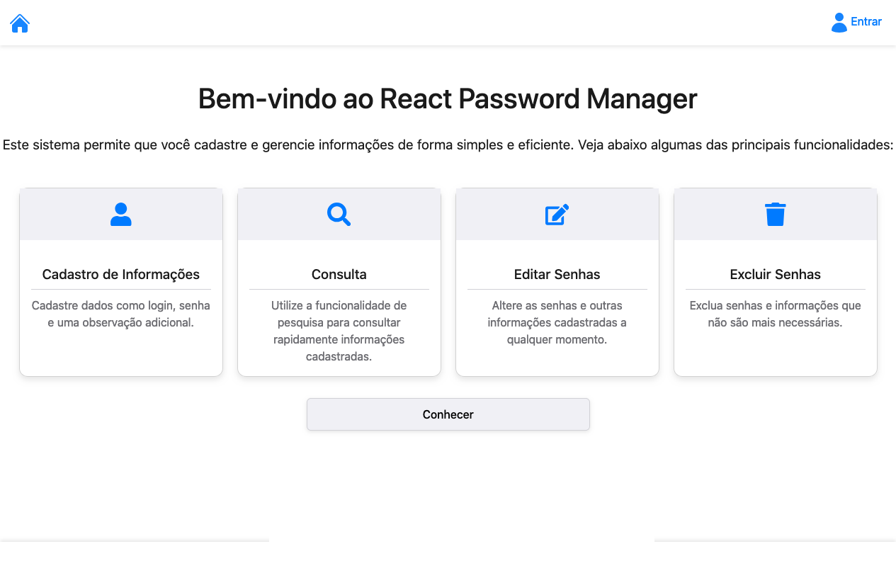
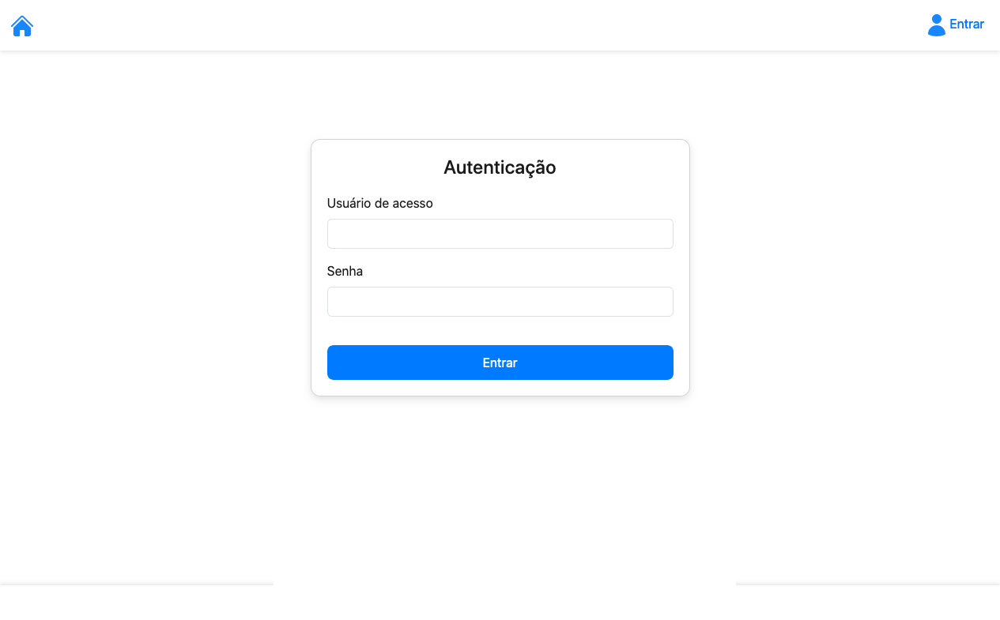
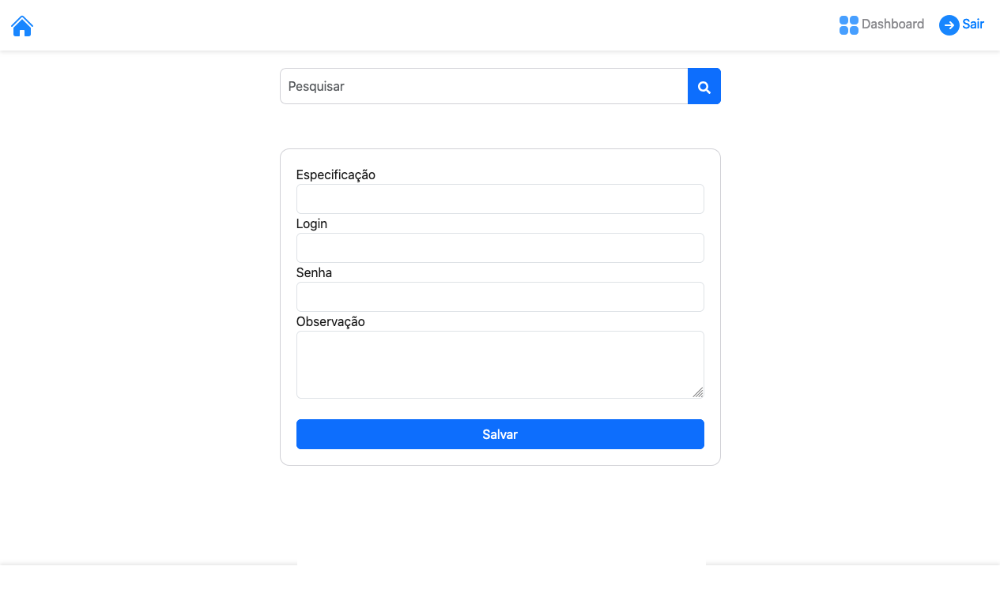
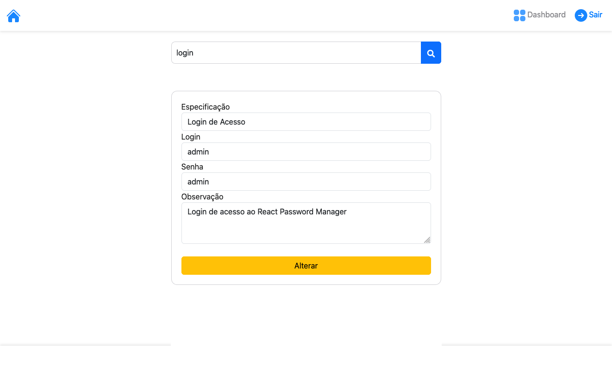

<h1 align="center">React Password Manager</h1>

<p align="center">
  
  
  
  
</p>

<p align="center">
  <b>Um gerenciador de especificações e autenticações de serviços simples, seguro e eficiente.</b>
</p>

---

## 📖 Sobre o Projeto

Este projeto foi desenvolvido para facilitar o gerenciamento de credenciais e especificações de serviços. Ele permite que usuários criem, editem, busquem e excluam registros (CRUD completo), armazenando logins, senhas e observações de forma organizada.

O sistema utiliza uma arquitetura separada, onde o **Frontend em React** consome uma **API REST em PHP**, garantindo dinamismo e segurança através de autenticação via Token.

## 🚀 Funcionalidades

-   **🔐 Autenticação Segura:** Login protegido com *Bearer Token* (via sessionStorage) para garantir que apenas usuários autorizados acessem a API.
-   **📝 Gerenciamento de Serviços (CRUD):**
    -   Cadastro de novas especificações (Login, Senha, Observações).
    -   Edição rápida de registros existentes.
    -   Exclusão de serviços obsoletos.
-   **🔍 Busca Dinâmica:** Campo de pesquisa integrado para localizar serviços rapidamente na base de dados.
-   **📱 Interface Responsiva:** Layout amigável construído com Bootstrap.

## 🛠️ Tecnologias Utilizadas

### Frontend
* [ReactJS](https://react.dev/) - Biblioteca para construção da interface.
* [Axios](https://axios-http.com) - Cliente HTTP para requisições à API.
* [Bootstrap](https://getbootstrap.com/) - Framework CSS para estilização e responsividade.
* [SweetAlert2](https://sweetalert2.github.io/) - Alertas bonitos e responsivos.
* [Google Fonts](https://fonts.google.com/) - Tipografia.

### Backend
* [PHP](https://www.php.net/) (v8+) - Linguagem do lado do servidor.
* [MySQL](https://www.mysql.com/) - Banco de dados relacional.

---

## 📸 Screenshots

<div align="center">
  <h3>Tela Inicial</h3>
  
  
  <h3>Autenticação</h3>
  

  <h3>Dashboard</h3>
  

  <h3>Busca de Serviços</h3>
  

  <h3>Edição</h3>
  
</div>

---

## ⚙️ Como Executar o Projeto

### Pré-requisitos
* Node.js e npm instalados.
* Servidor local para PHP/MySQL (como XAMPP, WAMP ou Docker).

### 1. Configuração do Backend (API)

1.  Certifique-se de ter o **PHP 8+** rodando.
2.  Crie um banco de dados no seu MySQL.
3.  Importe o script SQL fornecido no projeto para criar as tabelas necessárias.
4.  Configure a conexão com o banco de dados nos arquivos PHP da API.

### 2. Configuração do Frontend (React)

1.  Clone o repositório:
    ```bash
    git clone [https://github.com/aldhemir/react_password_manager.git](https://github.com/aldhemir/react_password_manager.git)
    ```

2.  Acesse a pasta do projeto:
    ```bash
    cd react_password_manager
    ```

3.  Instale as dependências:
    ```bash
    npm install
    ```

4.  Configure as variáveis de ambiente:
    * Crie um arquivo `.env` na raiz do projeto.
    * Adicione a URL da sua API:
    ```env
    VITE_API_URL=http://localhost/caminho-para-sua-api/
    ```

5.  Execute o projeto:
    ```bash
    npm run dev
    ```

---

## 🤝 Contribuindo

Contribuições são bem-vindas! Se você tiver sugestões de melhorias ou novas funcionalidades:

1.  Faça um Fork do projeto.
2.  Crie uma Branch para sua Feature (`git checkout -b feature/NovaFeature`).
3.  Faça o Commit (`git commit -m 'Adicionando nova feature'`).
4.  Faça o Push (`git push origin feature/NovaFeature`).
5.  Abra um Pull Request.

---

